# Hi 👋 I'm Krisha Kapadia
### ML • Data • Web Dev • Problem Solving

I enjoy exploring ideas, building things that actually work, and learning something new every day.  
Most of my projects revolve around AI/ML, full-stack development, and data — but I love experimenting across domains.  
Always curious, always improving 🚀

---

## 📌 Pinned Projects

  
  &nbsp;&nbsp;
  
  &nbsp;&nbsp;
  

---

## 📊 GitHub Stats

  
  

---

## 🧩 Contribution Graph

  

---

## 📈 Contribution Streak

  

---

## 🛠️ Tech Stack

  

---

## ✨ About Me

- 🌱 Currently exploring **AI/ML, MERN stack, and applied data science**  
- 💻 I enjoy building clean, functional, and intuitive applications  
- 📈 Interested in analytics, model building, and backend systems  
- 🧠 Strengthening DSA using C++  
- 🤝 Open to meaningful collaborations and internship/mentorship opportunities

> _“Keep building. Keep learning. Keep moving forward.”_

---

## 📬 Connect With Me

  
  &nbsp;
  

---

## ⚙️ Notes (for repo setup)

- This README expects these files inside the repo's `assets/` folder:
  - `assets/stats.svg`  
  - `assets/top-langs.svg`  
  - `assets/activity-graph.svg`  
  - `assets/streak.svg`  
  - `assets/pin-ipl-data-analysis.svg`  
  - `assets/pin-Calorie-Tracker.svg`  
  - `assets/pin-Loan-Approval-Prediction.svg`

- If you used the workflow I shared earlier, run it once (Actions → Update README stats images → Run workflow) to generate the `assets/*` files.  
- If you prefer not to use Actions, you can manually upload SVG files with the exact names above into `assets/`.

---

If you want a version without images (no Actions required) or a different visual theme (minimal / pastel / dark-neon), tell me which style and I’ll provide that README file next.
